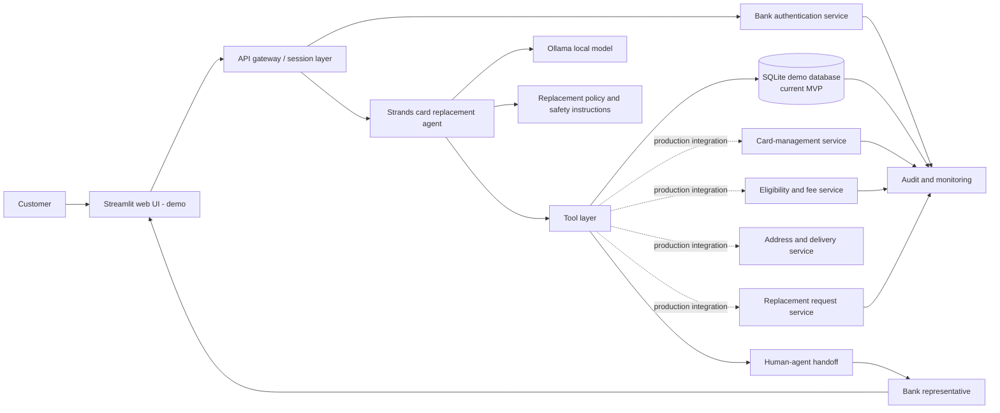
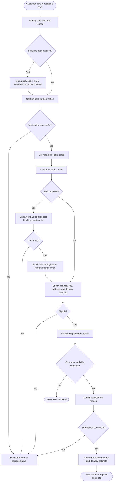

# Card Replacement Assistant Architecture

This design keeps the language model responsible for conversation and workflow
guidance, while authenticated backend services enforce every sensitive banking
operation.

## System architecture

## Replacement workflow

## Responsibility boundaries

| Component | Responsibility | Must not do |
| --- | --- | --- |
| Customer channel | Presents chat and established customer session | Send card secrets to the model |
| Strands agent | Converses, gathers non-sensitive context, calls approved tools | Authenticate users or enforce bank policy by prompt alone |
| Tool layer | Validates inputs and invokes backend services | Trust model-provided authorization without server-side checks |
| Bank services | Enforce identity, permissions, policy, card actions, and records | Return full PAN, CVV, PIN, password, or OTP to the agent |
| Human representative | Resolves disputes, fraud, failures, and exceptions | Bypass required bank controls |

## Control requirements

- Authentication and authorization must be checked again by each action tool.
- Blocking and replacement submission require explicit customer confirmation.
- The tool layer must enforce idempotency to prevent duplicate replacement orders.
- All card actions should be logged with a customer/session reference, request ID,
  tool result, and correlation ID.
- Fraud signals, disputed transactions, failed verification, and policy exceptions
  go to a human representative.
