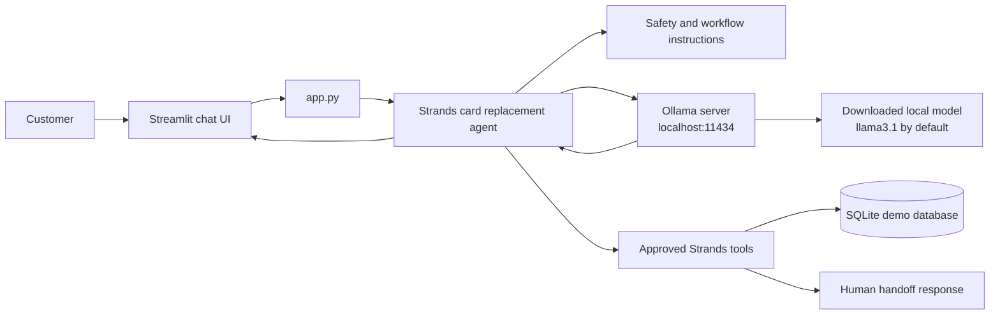
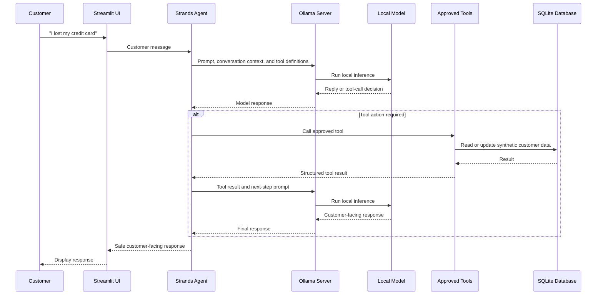

# Local Ollama Model Integration

This project runs its conversational model locally through an Ollama server.
The model is responsible for understanding the customer’s request, deciding
which approved tool to call, and writing the customer-facing reply. It does not
directly access the SQLite database: all database actions go through the
controlled tools in `tools/card_replacement.py`.

No paid model subscription, cloud API key, or external model request is needed
when Ollama is running locally.

## Configuration

The model is created in `agent.py` with Strands' `OllamaModel` provider:

```python
OllamaModel(
    host=os.getenv("OLLAMA_HOST", "http://localhost:11434"),
    model_id=os.getenv("OLLAMA_MODEL_ID", "llama3.1"),
    temperature=0.2,
)
```

| Setting | Default | Purpose |
| --- | --- | --- |
| `OLLAMA_HOST` | `http://localhost:11434` | Address of the local Ollama server. |
| `OLLAMA_MODEL_ID` | `llama3.1` | Name of the model downloaded with `ollama pull`. |
| `temperature` | `0.2` | Keeps responses more consistent for a banking workflow. |

For example, to use another already-downloaded model:

```bash
export OLLAMA_MODEL_ID=your-local-model-name
python -m streamlit run app.py
```

## Local startup

```bash
python -m pip install -r requirements.txt
ollama pull llama3.1
ollama serve
```

Then start the application in another terminal:

```bash
python -m streamlit run app.py
```

## Model architecture



## Request workflow



## Security boundary

The local model receives the system instructions, customer chat text, masked
card data returned by the tools, and tool results. It must not receive full card
numbers, CVVs, PINs, passwords, or one-time passcodes.

The model can suggest a tool action, but it cannot bypass the tool layer. The
tool and database layers enforce authentication checks, card ownership checks,
replacement confirmation, and audit-event recording. In a production bank,
replace the SQLite demo database with secured internal banking services while
keeping those checks in the backend.

## Troubleshooting

| Symptom | Resolution |
| --- | --- |
| Connection refused at port `11434` | Start Ollama with `ollama serve`. |
| Model not found | Download it with `ollama pull <model-name>` and set `OLLAMA_MODEL_ID` if needed. |
| `ModuleNotFoundError: ollama` | Run `python -m pip install -r requirements.txt` again. |
| Slow replies | Choose a smaller locally downloaded model or use hardware with more memory. |

For provider details and supported capabilities, see the [official Strands
Ollama documentation](https://strandsagents.com/docs/user-guide/concepts/model-providers/ollama/).
